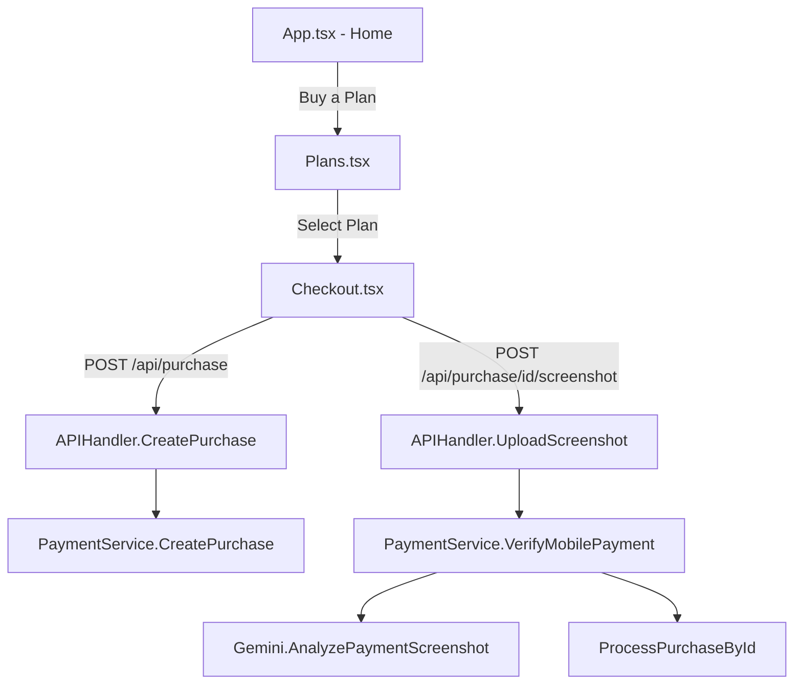

# Mini App Shop Feature — Implementation Plan

> **For Claude:** REQUIRED SUB-SKILL: Use superpowers:executing-plans to implement this plan task-by-task.

**Goal:** Add a full shop experience to the Telegram Mini App — users browse plans, select one, pay via KPay/Wave/AYA mobile banking, upload a screenshot, and Gemini verifies the payment automatically.

**Architecture:** The Mini App frontend gets new pages (Plans, Checkout, Upload). The Go backend gets new API endpoints (`POST /api/purchase`, `POST /api/upload-screenshot`, `GET /api/purchase/:id/status`). These endpoints reuse the existing `PaymentService.CreatePurchase()` and `PaymentService.VerifyMobilePayment()` logic — no duplicate business logic.

**Tech Stack:** React (frontend), Go `net/http` (backend), existing `PaymentService`, `Gemini` client, `database.MobilePaymentRepository`

---

## User Flow

```
┌─ Mini App ─────────────────────────────────────┐
│                                                │
│  1. Home Screen (existing)                     │
│     └─ [Buy a Plan] button                     │
│                                                │
│  2. Plans Screen (NEW)                         │
│     ├─ Plan Card: "Unlimited 30d — 10,000 MMK" │
│     ├─ Plan Card: "Unlimited 90d — 25,000 MMK" │
│     └─ Tap a card → Checkout                   │
│                                                │
│  3. Checkout Screen (NEW)                      │
│     ├─ Plan summary + price                    │
│     ├─ Payment instructions                    │
│     │   "Send 10,000 MMK to 09xxxxxxx"         │
│     │   "via KPay, Wave, or AYA Pay"            │
│     ├─ [Upload Screenshot] button              │
│     └─ Back button                             │
│                                                │
│  4. Upload & Verify (NEW)                      │
│     ├─ Camera/Gallery picker                   │
│     ├─ "Verifying..." spinner                  │
│     ├─ ✅ Success → "Subscription activated!"  │
│     └─ ❌ Failed → "Amount mismatch" / retry   │
└────────────────────────────────────────────────┘
```

## Proposed Changes

### Backend API

---

#### Task 1: Expand `APIHandler` to accept `PaymentService` and `bot.Bot`

Currently `APIHandler` only has `customerRepo`. We need `paymentService`, `bot`, and `mobilePaymentRepo` to create purchases and verify screenshots.

**Files:**
- Modify: `internal/api/handlers.go:26-32`
- Modify: `internal/api/server.go:19` (RegisterHandlers signature)
- Modify: `cmd/app/main.go` (pass new deps to RegisterHandlers)

**Changes:**
```go
// handlers.go
type APIHandler struct {
    customerRepo   *database.CustomerRepository
    paymentService *payment.PaymentService
    telegramBot    *bot.Bot
}

func NewAPIHandler(
    customerRepo *database.CustomerRepository,
    paymentService *payment.PaymentService,
    telegramBot *bot.Bot,
) *APIHandler {
    return &APIHandler{
        customerRepo:   customerRepo,
        paymentService: paymentService,
        telegramBot:    telegramBot,
    }
}
```

```go
// server.go — updated signature
func RegisterHandlers(
    mux *http.ServeMux,
    customerRepo *database.CustomerRepository,
    paymentService *payment.PaymentService,
    telegramBot *bot.Bot,
)
```

**Commit:** `refactor: expand APIHandler with payment dependencies`

---

#### Task 2: Add `POST /api/purchase` endpoint

Creates a mobile banking purchase and returns payment instructions.

**Files:**
- Modify: `internal/api/handlers.go` (add handler)
- Modify: `internal/api/server.go` (register route)

**Request:**
```json
POST /api/purchase
Authorization: tma <initData>
{ "plan_index": 0 }
```

**Response:**
```json
{
    "purchase_id": 123,
    "plan": { "label": "Unlimited", "days": 30, "price": 10000 },
    "payment_phone": "09xxxxxxxxx",
    "instructions": "Send exact amount to the phone number above via KPay, Wave, or AYA Pay. Then upload a screenshot."
}
```

**Handler logic:**
1. Get `telegram_id` from context (auth middleware).
2. Validate `plan_index` from request body.
3. Look up customer by telegram ID.
4. Call `paymentService.CreatePurchase(ctx, amount, days, trafficGB, customer, database.InvoiceTypeMobileBanking)`.
5. Return purchase ID + payment instructions.

**Commit:** `feat(api): add POST /api/purchase for mobile banking`

---

#### Task 3: Add `POST /api/purchase/{id}/screenshot` endpoint

Accepts a screenshot upload and triggers Gemini verification.

**Files:**
- Modify: `internal/api/handlers.go` (add handler)
- Modify: `internal/api/server.go` (register route)

**Request:**
```
POST /api/purchase/123/screenshot
Authorization: tma <initData>
Content-Type: multipart/form-data

file: <screenshot.jpg>
```

**Response (success):**
```json
{ "status": "success", "message": "Payment verified! Subscription activated." }
```

**Response (failure):**
```json
{ "status": "failed", "reason": "amount_mismatch", "message": "Amount does not match. Expected 10,000 MMK." }
```

**Handler logic:**
1. Parse `purchase_id` from URL path.
2. Parse multipart form file (max 10MB).
3. Read image bytes + detect MIME type.
4. Call `paymentService.VerifyMobilePayment(ctx, purchaseID, imageBytes, mimeType)`.
5. Return result as JSON.

**Commit:** `feat(api): add screenshot upload + Gemini verification endpoint`

---

#### Task 4: Add `GET /api/purchase/{id}/status` endpoint

Allows frontend to poll purchase status.

**Files:**
- Modify: `internal/api/handlers.go`
- Modify: `internal/api/server.go`

**Response:**
```json
{ "id": 123, "status": "paid", "plan_label": "Unlimited 30d" }
```

**Commit:** `feat(api): add purchase status polling endpoint`

---

### Frontend (React)

---

#### Task 5: Create `Plans` page component

**Files:**
- Create: `web-app/src/pages/Plans.tsx`

The page fetches `GET /api/plans` and renders plan cards. Each card shows label, days, price, traffic. Tapping a card navigates to `/checkout/:planIndex`.

**Design:**
- Cards with gradient borders
- Price prominently displayed
- "Select" button per card
- Back button → Home

**Commit:** `feat(web): add Plans page with pricing cards`

---

#### Task 6: Create `Checkout` page component

**Files:**
- Create: `web-app/src/pages/Checkout.tsx`

**Flow:**
1. On mount: `POST /api/purchase` with `plan_index` from URL param.
2. Display payment instructions (phone number, amount).
3. Show "Upload Screenshot" button.
4. On upload: `POST /api/purchase/{id}/screenshot` with the file.
5. Show spinner during verification.
6. Show result (success/failure).

**Design:**
- Plan summary card at top
- Payment info box with phone number + amount
- Provider logos (KPay, Wave, AYA)
- Upload button (camera icon)
- Full-screen loading overlay during verification
- Success: green checkmark animation
- Failure: red X with retry button

**Commit:** `feat(web): add Checkout page with screenshot upload`

---

#### Task 7: Add routing and navigation

**Files:**
- Modify: `web-app/src/App.tsx` (add router)
- Modify: `web-app/src/main.tsx` (wrap with BrowserRouter)

**Routes:**
| Path | Component | Auth |
|------|-----------|------|
| `/` | Home | ✓ |
| `/plans` | Plans | ✓ |
| `/checkout/:planIndex` | Checkout | ✓ |

**Add "Buy a Plan" button to Home page** (below subscription status).

**Commit:** `feat(web): add SPA routing for shop pages`

---

#### Task 8: Build, test, and commit

**Steps:**
1. `cd web-app && npm run build`
2. Verify no TypeScript errors.
3. Test manually in Telegram (if possible).

**Commit:** `chore: rebuild Mini App with shop features`

---

## Verification Plan

### Automated
```bash
cd web-app && npm run build    # Frontend compiles
go build ./...                 # Backend compiles (if go available)
```

### Manual
1. Open Mini App in Telegram.
2. Tap "Buy a Plan" → Plans page loads with cards.
3. Tap a plan → Checkout shows payment instructions.
4. Upload a screenshot → Gemini verifies → Success/Failure shown.
5. On success → subscription activated, Home page updated.

---

## Dependencies Map



## Risk Assessment

| Risk | Mitigation |
|------|-----------|
| Large file upload timeout | Set 10MB limit, show progress |
| Gemini API failure | Return friendly error, allow retry |
| Duplicate screenshot | Existing `ExistsByTransactionID` check handles this |
| User closes app mid-verification | Purchase stays pending, can retry later |
